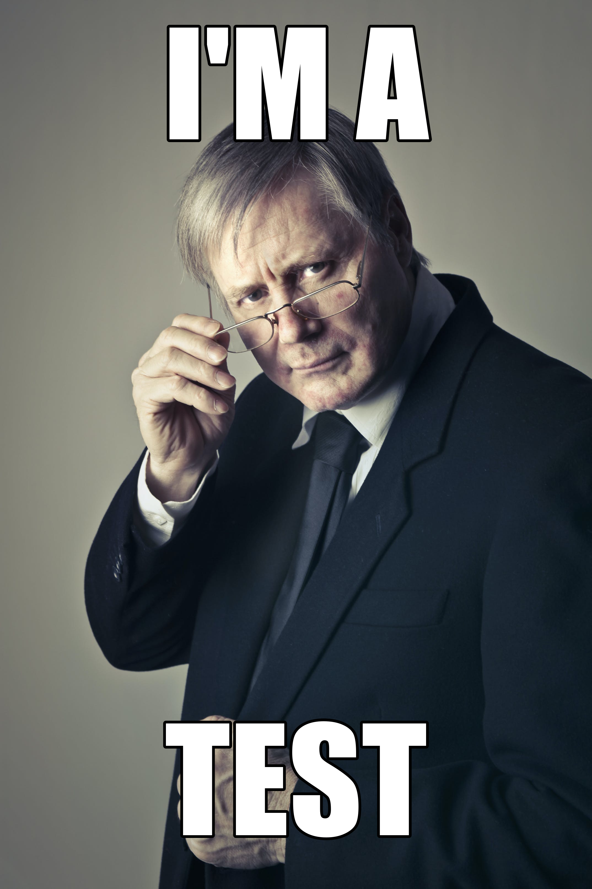

# Retro Giggle

Retro giggle is a simple tool written in python that generates memes in the old style.

## Installation

Check you have python installed in your machine, clone the repository and install the requirements

```bash
git clone https://github.com/marcotduenas/retro-giggle.git
cd retro-giggle
pip install -r requirements.txt
```

## Usage

```bash
python main.py
```

And follow the instructions

## Contribution

The project is under the GPLv3, so, feel free to edit the source code

## Contact

For help or feedback, e-mail me :)



